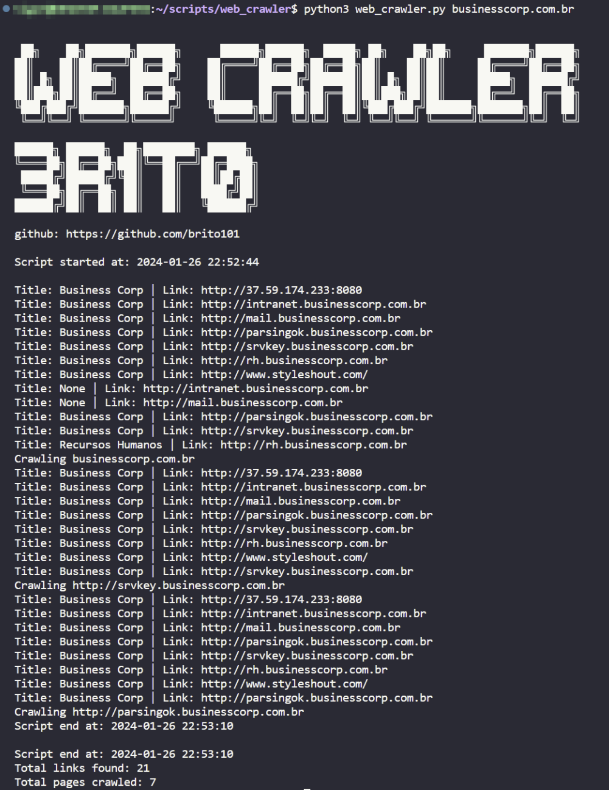

# Web Crawler

## Introduction

Web Crawler to map the links present in a domain, presenting external links and maintaining the focus on the domain. To execute, simply pass the pure domain as a parameter, as the script will check the need for https and www.

The return will present the start and end time and links with their respective titles, if any.

  

## Installation

To install Web Crawler and make it directly callable from the terminal:

Clone the Repository:

- `git clone https://github.com/brito101/web_crawler.git`
- `cd web_crawler`

Run the Installation Script: First, ensure the script is executable:

- `chmod +x install.sh`

Then, execute the script:

- `sudo ./install.sh`

After a successful installation, you can call web_crawler directly from any terminal window.

## Usage:

- `web_crawler domain`
- Ex: `web_crawler rodrigobrito.dev.br`
